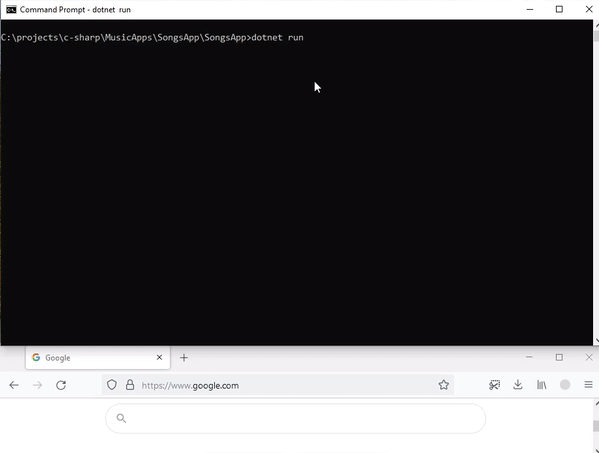

# Songs-app

## Search + play songs ⋆ files or spotify ⋆ lyrics summary   

- find+play mp3 files
- find+open song's spotify link
- get lyrics
- get song summary (details below)

Edit configuration to use services (only the lyrics service doesn't require a token currently).   

 

*update: turns out spotify's search also works with lyrics keywords.

 

### lyrics summary

I use a beta version of azure's text analytics to get a summary of the song.
Pretty sure it wasn't meant for this :). Anyway, the results depend heavily on punctuation marks.  

 

